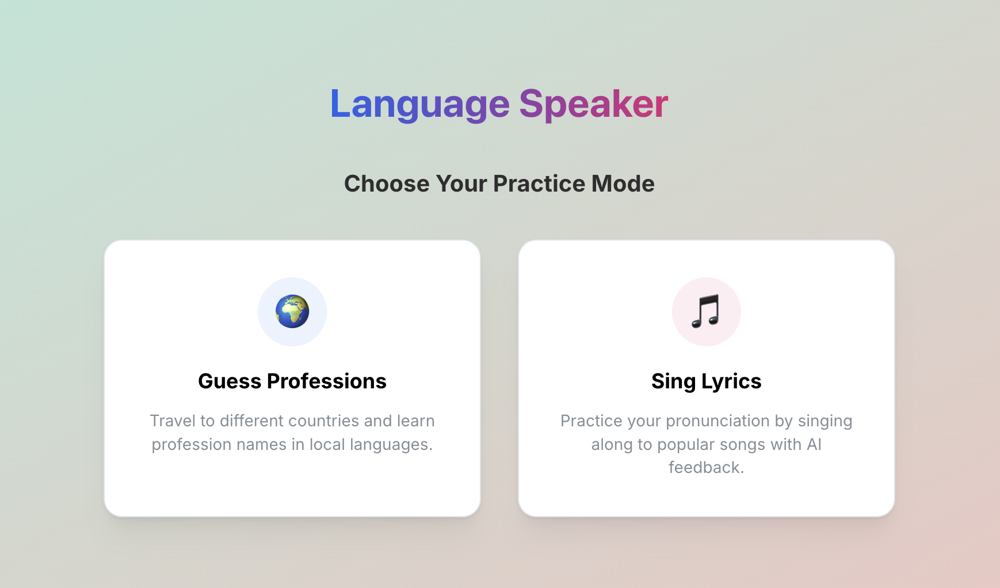

# Language Speaker (Playground)

An interactive web application for practicing speaking local languages (Singaporean English, Malay, Japanese, Korean) by identifying professions or singing lyrics through voice recognition.

## 🎯 Description

Language Speaker is a fun and engaging language learning app that helps users practice speaking different languages. The app features two exciting modes: **Guess Professions**, where you identify jobs in different languages, and **Sing Lyrics**, where you practice pronunciation by singing lines from songs. It uses AI-powered speech recognition to find the song and provide next lines or explain the meaning of the lyrics.

### Features

- 🌏 **Multi-language Support**: Practice English, Malay, Japanese, and Korean
- 🎮 **Two Game Modes**: Choose between learning vocabulary (Professions) or fluency (Lyrics)
- 🎵 **Lyrics Practice**: Sing songs and get AI-powered feedback and contexts
- 🎤 **AI Speech Recognition**: Powered by Whisper (Transformers.js) for accurate transcription
- 🔊 **Natural Voice Feedback**: High-quality TTS using SpeechT5 model
- 🎨 **Modern UI**: Beautiful glassmorphism design with smooth animations

## Repository Structure

-   **[frontend/](./frontend/)**: Next.js + React frontend application.
-   **[backend/](./backend/)**: Python FastAPI backend service.
-   **[infra/](./infra/)**: Infrastructure and deployment configurations.

## Quick Start

### 1. Clone the Repository

```bash
git clone <repository-url>
cd language-speaker
```

### 2. Start the Backend
```bash
cd backend
pip3 install -r requirements.txt
python3 main.py
```

### 3. Start the Frontend
```bash
cd frontend
npm install
npm run dev
```

Open [http://localhost:3000](http://localhost:3000) to play!

## 🎮 How to Use

### 1. Choose Your Mode
Select one of the two available modes from the home screen:

### Landing Page


### 🌍 Guess Professions Mode
1. **Select a Country** - Choose which language you want to practice
2. **View the Profession** - An image of a profession will appear
3. **Speak the Answer** - Click the microphone and say the profession name in the selected language
4. **Get Feedback** - Receive instant voice and text feedback

### 🎵 Sing Lyrics Mode
1. **Start Singing** - Click the microphone to start listening
2. **Sing a Line** - Sing a line from a song you know
3. **Get Insights** - The AI will identify the song and explain the meaning of the lyrics or provide the next line